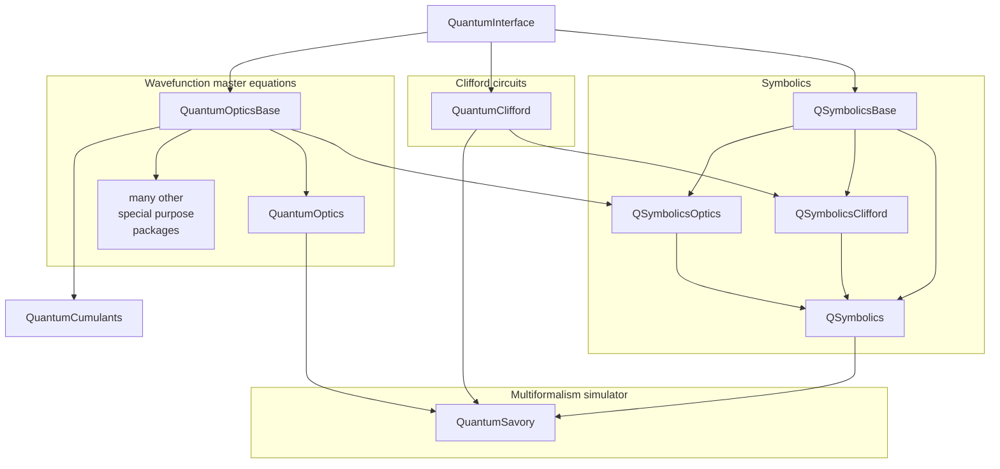

# QuantumInterface

This package is not meant for public use!

Please contact us if you plan to depend directly on this package as we frequently coordinate breaking changes to it.

On the other hand, we do respect semantic versioning, so at worst you would be stuck on an old version of the package, but you should not have your code break unexpectedly due to a change made by us.

This package contains formal and informal definitions of common interfaces used by:

- [`QuantumOpticsBase.jl`](https://github.com/qojulia/QuantumOpticsBase.jl/)
- [`QuantumOptics.jl`](https://github.com/qojulia/QuantumOptics.jl/)
- [`QuantumClifford.jl`](https://github.com/Krastanov/QuantumClifford.jl)
- [`QSymbolics.jl`](https://github.com/Krastanov/QSymbolics.jl)
- [`QuantumSavory.jl`](https://github.com/Krastanov/QuantumSavory.jl)
- [`and others`](https://juliahub.com/ui/Packages/QuantumInterface/a9rji/?page=2)

