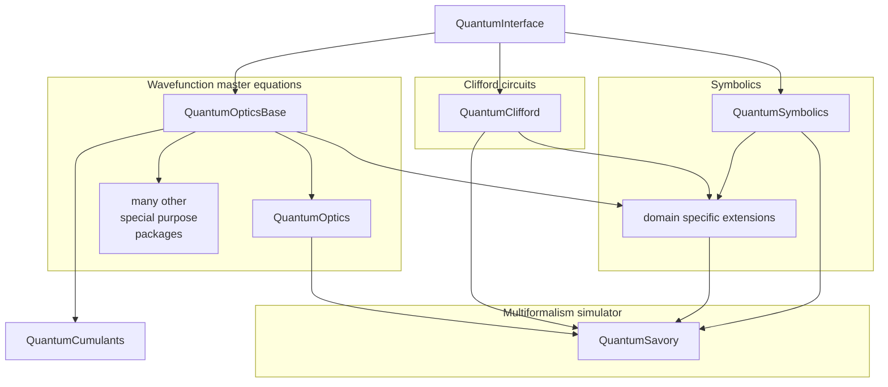

# QuantumInterface

This package is not meant for public use!

Please contact us if you plan to depend directly on this package as we frequently coordinate breaking changes to it.

On the other hand, we do respect semantic versioning, so at worst you would be stuck on an old version of the package, but you should not have your code break unexpectedly due to a change made by us.

This package contains formal and informal definitions of common interfaces used by:

- [`QuantumOpticsBase.jl`](https://github.com/qojulia/QuantumOpticsBase.jl/) - a library defining data structures for Schroedinger-style quantum simulations (e.g. dense and sparse matrix operators and vector kets)
- [`QuantumOptics.jl`](https://github.com/qojulia/QuantumOptics.jl/) - provides dynamic equations over types defined in `QuantumOpticsBase`
- [`QuantumClifford.jl`](https://github.com/QuantumSavory/QuantumClifford.jl) - implements the typical stabilizer tableaux formalism
- [`QuantumSymbolics.jl`](https://github.com/QuantumSavory/QuantumSymbolics.jl) - general purpose symbolic algebra for quantum information science, focusing on automatically transforming symbolic expressions into other formalisms (vectors, tableaux, etc)
- [`QuantumSavory.jl`](https://github.com/QuantumSavory/QuantumSavory.jl) - a multi-formalism simulator building up on the other tools
- [`and others`](https://juliahub.com/ui/Packages/QuantumInterface/a9rji/?page=2)

